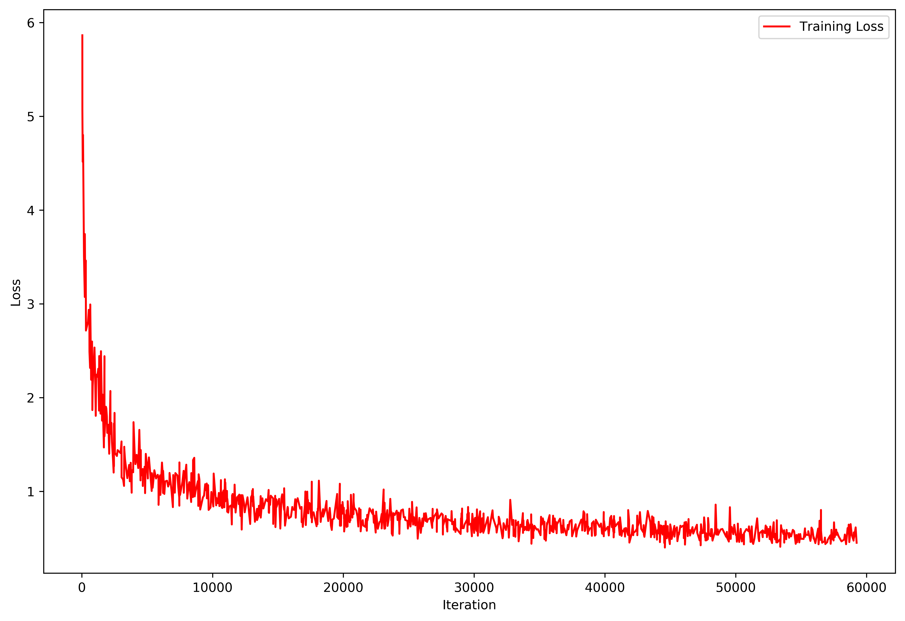

# Singing Voice Separation RNN

## Introduction

This is a singing voice sepration tool developed using recurrent neural network (RNN). It could seperate the singer voice and the background music from the original song. It is still in the development stage since the separation has not been perfect yet. Please check the demo for the performance.

## Dependencies

* Python 3.5
* Numpy 1.14
* TensorFlow 1.8
* RarFile 3.0
* ProgressBar2 3.37.1
* LibROSA 0.6
* [FFmpeg 4.0](https://github.com/librosa/librosa#audioread)
* Matplotlib 2.1.1

## Files

```bash
.
├── demo
│   ├── backstreet_boys-i_want_it_that_way_mono.wav
│   ├── backstreet_boys-i_want_it_that_way_src1.wav
│   └── backstreet_boys-i_want_it_that_way_src2.wav
├── download.py
├── evaluate.py
├── figures
│   └── training_loss.png
├── LICENSE.md
├── main.py
├── model
│   ├── checkpoint
│   ├── svsrnn.ckpt.data-00000-of-00001
│   ├── svsrnn.ckpt.index
│   └── svsrnn.ckpt.meta
├── model.py
├── preprocess.py
├── README.md
├── songs
│   └── backstreet_boys-i_want_it_that_way.mp3
├── statistics
│   └── run_20180516-190554-tag-summaries_loss.csv
├── train.py
└── utils.py
```

## Dataset

### MIR-1K Dataset

Multimedia Information Retrieval, 1000 song clips ([MIR-1K](https://sites.google.com/site/unvoicedsoundseparation/mir-1k)), dataset for singing voice separation.

To download the whole dataset, and split into train, validation, and test set, in the terminal:

```bash
$ python download.py 
```

## Usage

### Train Model

To train the model, in the terminal:

```bash
$ python train.py
```
The training took roughly 45 minutes for 50,000 iterations on the train set of MIR-1K dataset using NVIDIA GTX TITAN X graphic card. 

<p align="center">
    
</p>

The program loads all the MIR-1K dataset into memory and stores all the processed MIR-1K data in the memory to accelerate the data sampling for training. However, this may cosume more than 10 GB of memory.

The trained model would be saved to the ``model`` directory.

### Evaludate Model

To evaludate the model, in the terminal:

```bash
$ python evaluate.py
```

The evaluation took roughly 1 minute on the test set of MIR-1K dataset using NVIDIA GTX TITAN X graphic card. The separated sources, together with the monaural source, would be saved to the ``demo`` directory.

*To do: The evaluation statistics would be saved.*

### Separate Sources for Customized Songs

To separate sources for customized songs, put the MP3 formatted songs to the ``songs`` directory, in the terminal:

```bash
$ python main.py
```

The separated sources, together with the monaural source, would be saved to the ``demo`` directory.

## Demo

The MP3 of "Backstreet Boys - I want it that way", ``backstreet_boys-i_want_it_that_way.mp3``
, was put to the ``songs`` directory. Using the pre-trained model in the ``model`` diretory, in the terminal:

```bash
$ python main.py
```

The separated sources, ``backstreet_boys-i_want_it_that_way_src1.mp3`` and ``backstreet_boys-i_want_it_that_way_src2.mp3``, together with the monaural source, ``backstreet_boys-i_want_it_that_way_mono.mp3``, were saved to the ``demo`` directory.


## References

* Po-Sen Huang, Minje Kim, Mark Hasegawa-Johnson, Paris Smaragdis, Singing-Voice Separation From Monaural Recordings Using Deep Recurrent Neural Networks. 2014.
* Po-Sen Huang, Minje Kim, Mark Hasegawa-Johnson, Paris Smaragdis, Joint Optimization of Masks and Deep Recurrent Neural Networks for Monaural Source Separation. 2015.
* Dabi Ahn's Music Source Separation [Repository](https://github.com/andabi/music-source-separation)
